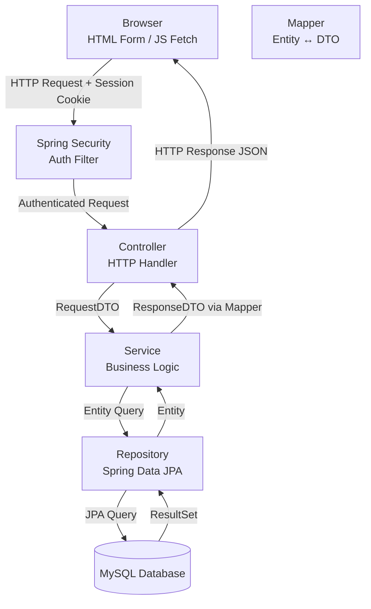
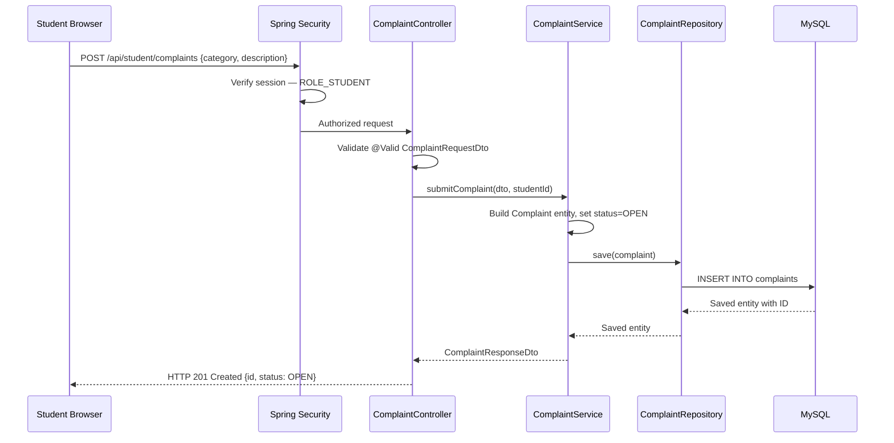
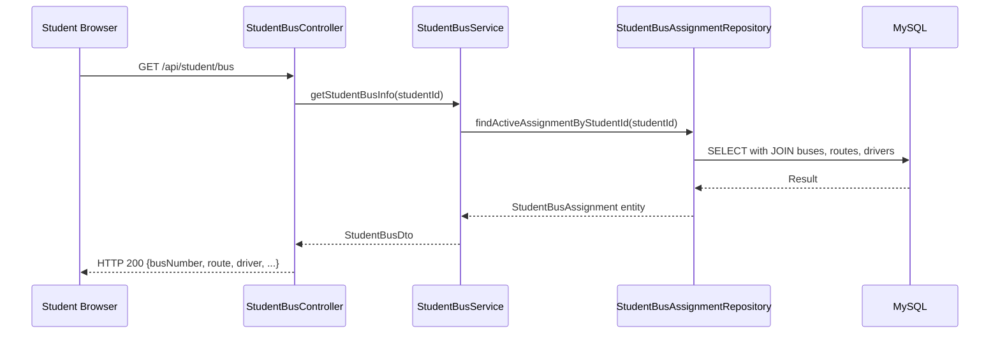
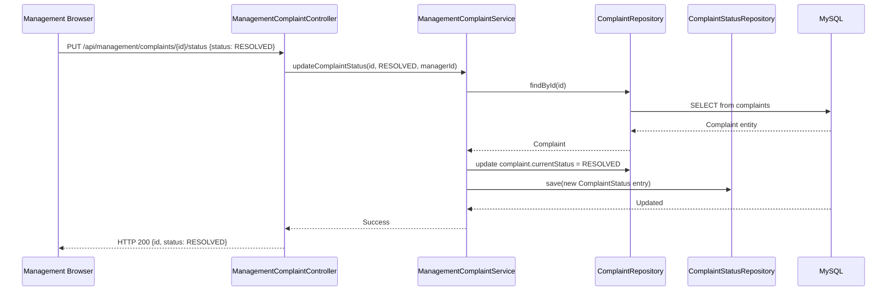

# MBU RouteX — Data Flow

> **Status:** PLANNED  
> **Version:** 1.0

---

## Overview

This document describes the flow of data through the MBU RouteX system — from user input, through the Spring Boot layers, to the database, and back to the client.

---

## Data Flow Diagram — Overall System

---

## Data Flow — Complaint Submission (Student)

---

## Data Flow — Student Views My Bus

---

## Data Flow — Management Updates Complaint Status

---

*MBU RouteX — TRACK · TRAVEL · CONNECT*
