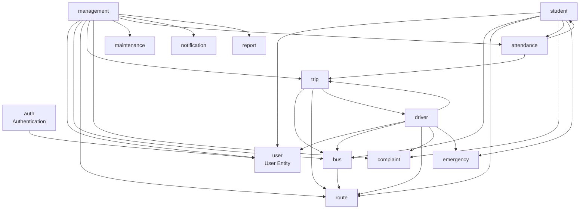

# MBU RouteX — Module Architecture

> **Status:** PLANNED  
> **Version:** 1.0

---

## Module Overview

MBU RouteX is organized as a modular monolith. Each domain module is self-contained with its own controller, service, repository, entity, and DTO layers.

---

## Module Dependency Diagram

---

## Module Descriptions

| Module | Package | Responsibility |
|---|---|---|
| `auth` | `com.mbu.routex.auth` | Login, authentication, CustomUserDetailsService |
| `user` | `com.mbu.routex.user` | Base User entity and repository |
| `student` | `com.mbu.routex.student` | Student profile, bus info, complaints, QR, attendance |
| `driver` | `com.mbu.routex.driver` | Driver profile, bus status, service, complaints, schedule |
| `management` | `com.mbu.routex.management` | Fleet, trip monitoring, complaints, maintenance, reports |
| `bus` | `com.mbu.routex.bus` | Bus entity and repository |
| `route` | `com.mbu.routex.route` | Route and RouteStop entities |
| `trip` | `com.mbu.routex.trip` | Trip entity and repository |
| `complaint` | `com.mbu.routex.complaint` | Complaint and ComplaintStatus entities |
| `maintenance` | `com.mbu.routex.maintenance` | MaintenanceRecord entity |
| `attendance` | `com.mbu.routex.attendance` | Attendance and QRCode entities |
| `notification` | `com.mbu.routex.notification` | Notification entity |
| `emergency` | `com.mbu.routex.emergency` | EmergencyContact entity |
| `report` | `com.mbu.routex.report` | Report entity |
| `common` | `com.mbu.routex.common` | Shared utilities, exception handler, config |

---

## Shared Common Module

The `common` module provides cross-cutting concerns used by all modules:

- `GlobalExceptionHandler` — `@ControllerAdvice`
- `ErrorResponse` — standard error response DTO
- `SecurityConfig` — Spring Security configuration
- `QRCodeUtil` — QR code generation utility
- `DateUtil` — date formatting utilities

---

*MBU RouteX — TRACK · TRAVEL · CONNECT*
