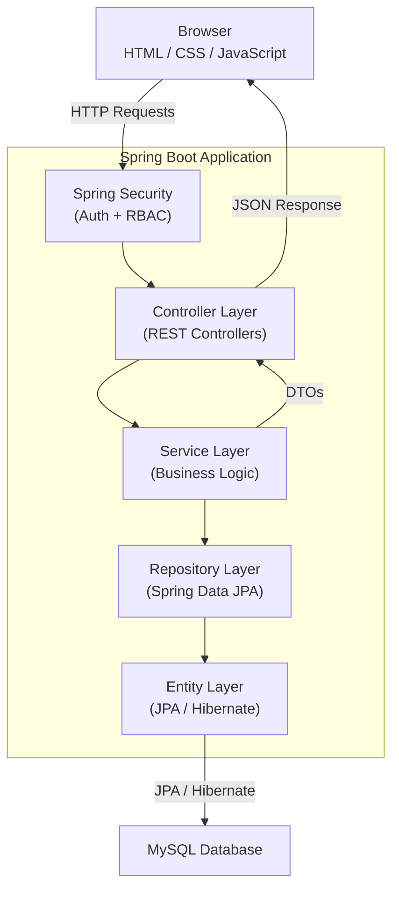
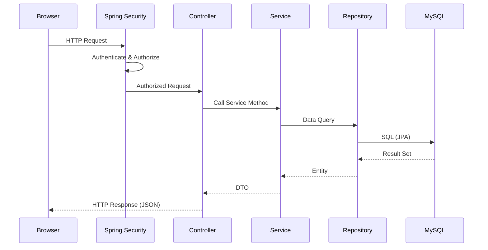
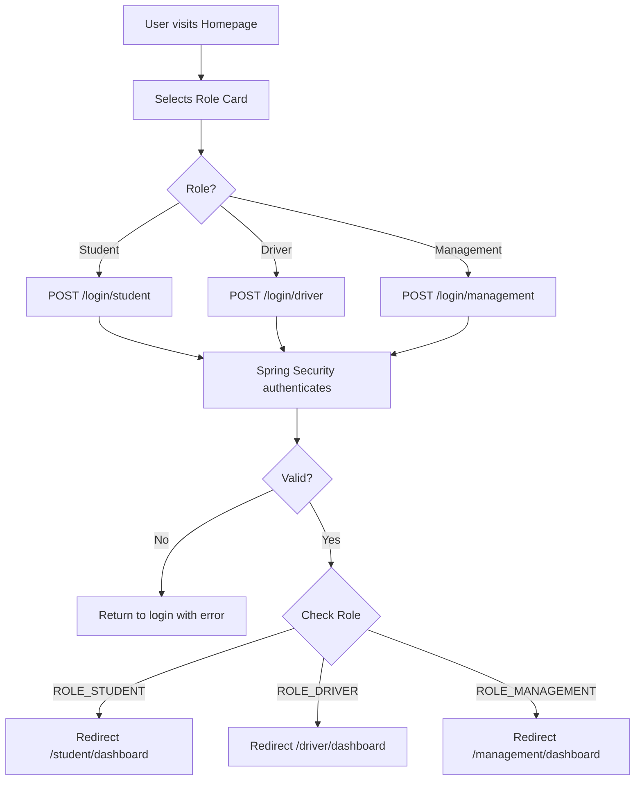

# MBU RouteX — System Architecture

> **Status:** PLANNED  
> **Version:** 1.0

---

## Architecture Pattern

MBU RouteX uses a **Modular Monolith** architecture for the initial release.

This means:
- A single deployable application
- Internal module separation by domain
- Clear layer boundaries: Controller → Service → Repository → Entity
- Supports future extraction of modules into services if needed

---

## High-Level Architecture



---

## Application Layers

| Layer | Responsibility |
|---|---|
| **Controller** | Handle HTTP requests; map URLs to service calls; return responses |
| **Service** | Business logic; validation; transaction management; data transformation |
| **Repository** | Database access via Spring Data JPA; queries |
| **Entity** | JPA-mapped domain objects corresponding to database tables |
| **DTO** | Data transfer objects for API request/response payloads |
| **Mapper** | Map between Entity and DTO (manual or MapStruct) |
| **Security** | Spring Security: authentication, authorization, session management |
| **Exception** | Global exception handling; consistent error responses |
| **Configuration** | Application configuration, Spring Security config, CORS, etc. |

---

## Module Structure

```
com.mbu.routex
├── auth/
│   ├── controller/
│   ├── service/
│   ├── dto/
│   └── security/
├── student/
│   ├── controller/
│   ├── service/
│   ├── repository/
│   ├── entity/
│   └── dto/
├── driver/
│   ├── controller/
│   ├── service/
│   ├── repository/
│   ├── entity/
│   └── dto/
├── management/
│   ├── controller/
│   ├── service/
│   ├── repository/
│   ├── entity/
│   └── dto/
├── bus/
├── route/
├── trip/
├── complaint/
├── maintenance/
├── attendance/
├── emergency/
├── notification/
├── report/
├── common/
│   ├── exception/
│   ├── config/
│   └── util/
└── MbuRoutexApplication.java
```

---

## Request Flow



---

## Authentication Flow



---

## Security Architecture

- **Authentication:** Spring Security form-based login (session) or JWT — TO BE DEFINED
- **Password storage:** BCrypt hashing
- **Authorization:** Role-based — `@PreAuthorize` or `HttpSecurity` config
- **Session:** Server-side session (initial); JWT optional for future
- **CSRF:** Enabled for form-based; may be disabled for REST if using JWT
- **HTTPS:** Required in production

---

*MBU RouteX — TRACK · TRAVEL · CONNECT*
