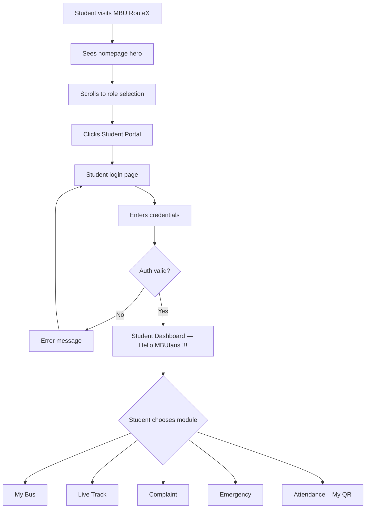
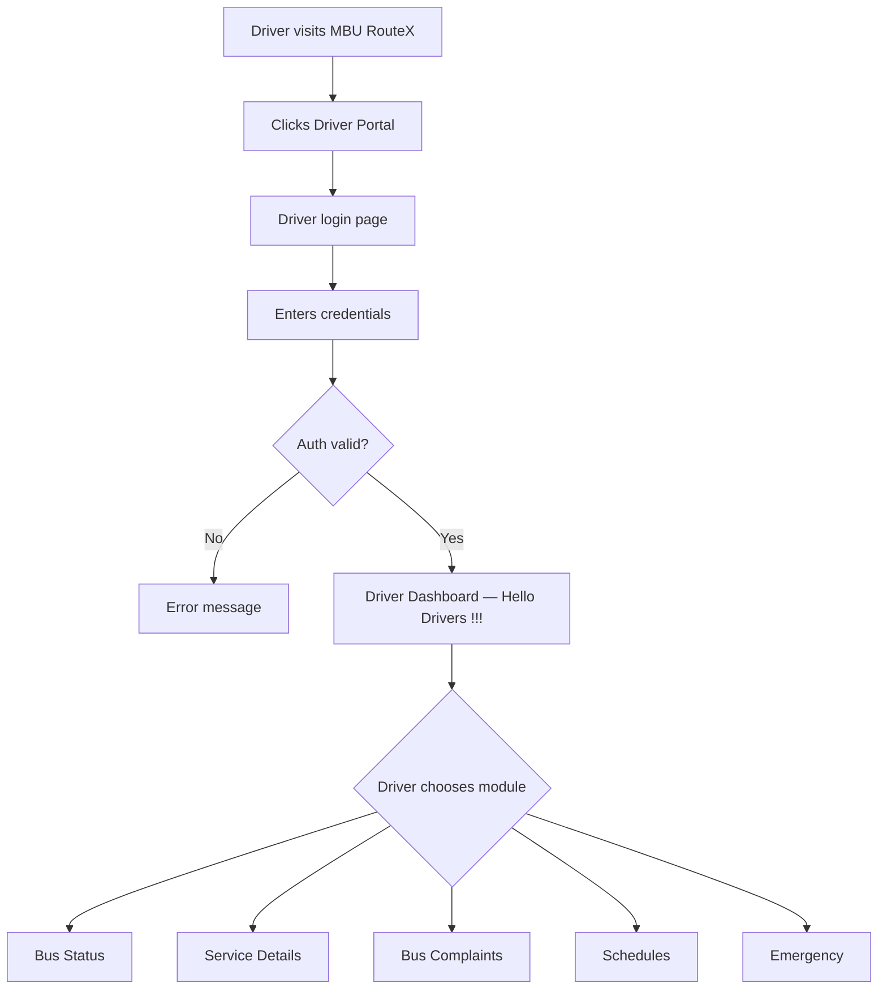
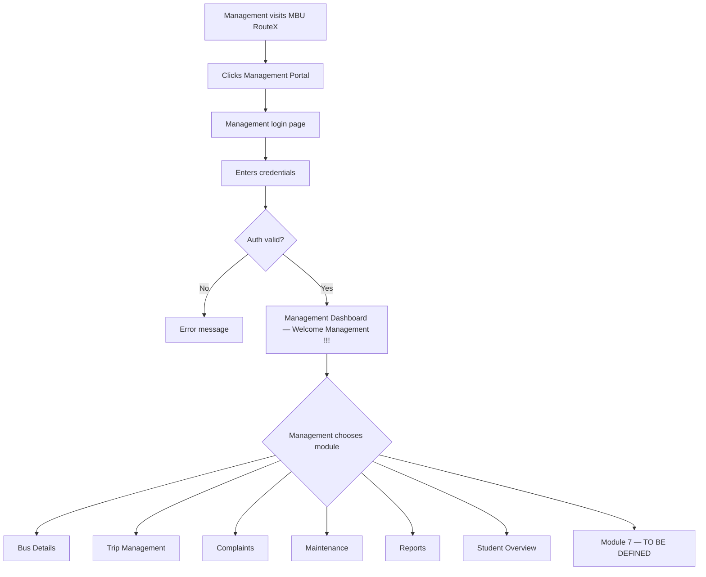
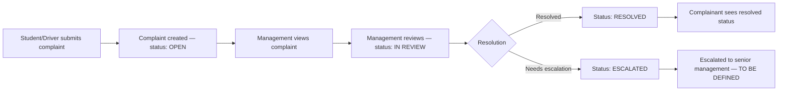
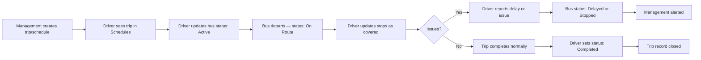
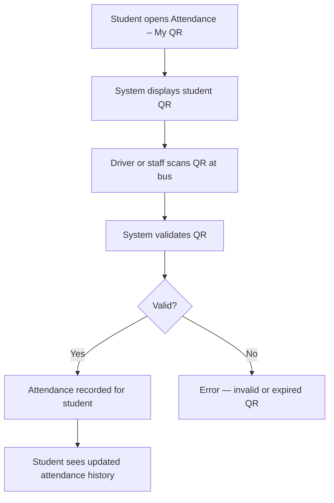
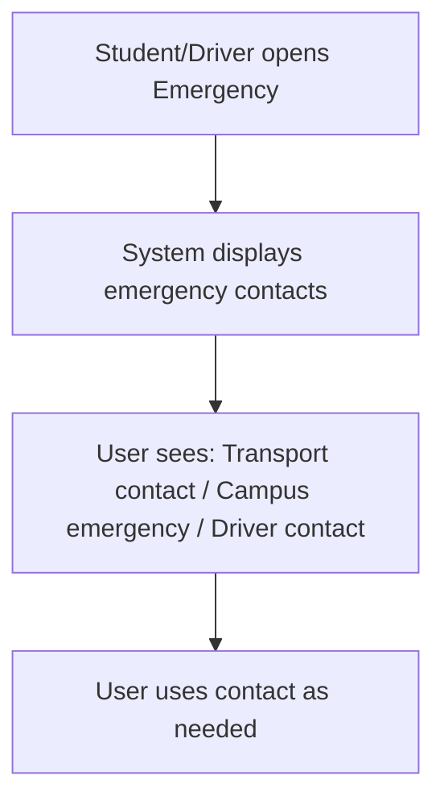

# MBU RouteX — System Workflows

> **Status:** PLANNED  
> **Version:** 1.0

---

## WF-01: Student Complete Journey

---

## WF-02: Driver Complete Journey

---

## WF-03: Management Complete Journey

---

## WF-04: Complaint Lifecycle

---

## WF-05: Trip Lifecycle

---

## WF-06: QR Attendance Flow

---

## WF-07: Emergency Access

---

*MBU RouteX — TRACK · TRAVEL · CONNECT*
