# MBU RouteX — Entity Relationships (ER Diagram)

> **Status:** PLANNED  
> **Version:** 1.0

---

## Entity Relationship Diagram

```mermaid
erDiagram
    USERS {
        bigint id PK
        varchar username
        varchar email
        varchar password_hash
        enum role
        boolean is_active
        datetime created_at
        datetime updated_at
    }

    STUDENTS {
        bigint id PK
        bigint user_id FK
        varchar student_id
        varchar full_name
        varchar phone
        varchar department
        varchar year
        datetime created_at
    }

    DRIVERS {
        bigint id PK
        bigint user_id FK
        varchar driver_id
        varchar full_name
        varchar phone
        varchar license_number
        datetime created_at
    }

    MANAGEMENT_USERS {
        bigint id PK
        bigint user_id FK
        varchar full_name
        varchar department
        datetime created_at
    }

    BUSES {
        bigint id PK
        varchar bus_number
        varchar registration
        varchar college_serial
        int capacity
        enum status
        datetime created_at
        datetime updated_at
    }

    ROUTES {
        bigint id PK
        varchar route_name
        varchar route_code
        varchar start_point
        varchar end_point
        boolean is_active
        datetime created_at
    }

    ROUTE_STOPS {
        bigint id PK
        bigint route_id FK
        varchar stop_name
        int stop_order
        varchar location_description
        datetime created_at
    }

    TRIPS {
        bigint id PK
        bigint bus_id FK
        bigint route_id FK
        bigint driver_id FK
        datetime scheduled_departure
        datetime actual_departure
        datetime scheduled_arrival
        datetime actual_arrival
        enum status
        datetime created_at
    }

    BUS_ASSIGNMENTS {
        bigint id PK
        bigint bus_id FK
        bigint route_id FK
        date effective_from
        date effective_to
        boolean is_active
    }

    DRIVER_ASSIGNMENTS {
        bigint id PK
        bigint driver_id FK
        bigint bus_id FK
        date effective_from
        date effective_to
        boolean is_active
    }

    STUDENT_BUS_ASSIGNMENTS {
        bigint id PK
        bigint student_id FK
        bigint bus_id FK
        bigint boarding_stop_id FK
        date effective_from
        date effective_to
        boolean is_active
    }

    COMPLAINTS {
        bigint id PK
        bigint submitted_by FK
        varchar submitter_type
        varchar category
        text description
        bigint bus_id FK
        bigint trip_id FK
        enum current_status
        text management_response
        datetime created_at
        datetime updated_at
    }

    COMPLAINT_STATUSES {
        bigint id PK
        bigint complaint_id FK
        enum status
        bigint changed_by FK
        text notes
        datetime changed_at
    }

    MAINTENANCE_RECORDS {
        bigint id PK
        bigint bus_id FK
        varchar component
        text description
        date service_date
        date next_service_date
        enum status
        bigint recorded_by FK
        datetime created_at
    }

    QR_CODES {
        bigint id PK
        bigint student_id FK
        varchar qr_token
        boolean is_active
        datetime created_at
        datetime expires_at
    }

    ATTENDANCE {
        bigint id PK
        bigint student_id FK
        bigint trip_id FK
        bigint qr_code_id FK
        datetime scanned_at
        enum status
    }

    NOTIFICATIONS {
        bigint id PK
        bigint user_id FK
        varchar title
        text message
        boolean is_read
        datetime created_at
    }

    EMERGENCY_CONTACTS {
        bigint id PK
        varchar name
        varchar role
        varchar phone
        varchar category
        boolean is_active
    }

    REPORTS {
        bigint id PK
        bigint generated_by FK
        varchar report_type
        date period_from
        date period_to
        text report_data
        datetime generated_at
    }

    %% Relationships
    USERS ||--o| STUDENTS : "has profile"
    USERS ||--o| DRIVERS : "has profile"
    USERS ||--o| MANAGEMENT_USERS : "has profile"

    ROUTES ||--o{ ROUTE_STOPS : "has stops"

    BUSES ||--o{ TRIPS : "runs"
    ROUTES ||--o{ TRIPS : "covers"
    DRIVERS ||--o{ TRIPS : "operates"

    BUSES ||--o{ BUS_ASSIGNMENTS : "assigned via"
    ROUTES ||--o{ BUS_ASSIGNMENTS : "assigned via"

    DRIVERS ||--o{ DRIVER_ASSIGNMENTS : "assigned via"
    BUSES ||--o{ DRIVER_ASSIGNMENTS : "assigned via"

    STUDENTS ||--o{ STUDENT_BUS_ASSIGNMENTS : "assigned via"
    BUSES ||--o{ STUDENT_BUS_ASSIGNMENTS : "assigned via"

    STUDENTS ||--o{ COMPLAINTS : "submits"
    BUSES ||--o{ COMPLAINTS : "related to"

    COMPLAINTS ||--o{ COMPLAINT_STATUSES : "has history"

    BUSES ||--o{ MAINTENANCE_RECORDS : "has records"

    STUDENTS ||--|| QR_CODES : "has QR"

    TRIPS ||--o{ ATTENDANCE : "records"
    STUDENTS ||--o{ ATTENDANCE : "recorded in"
    QR_CODES ||--o{ ATTENDANCE : "used in"

    USERS ||--o{ NOTIFICATIONS : "receives"

    MANAGEMENT_USERS ||--o{ REPORTS : "generates"
```

---

## Relationship Descriptions

| Relationship | Type | Description |
|---|---|---|
| User → Student | One-to-One | Each user account has at most one student profile |
| User → Driver | One-to-One | Each user account has at most one driver profile |
| User → ManagementUser | One-to-One | Each user account has at most one management profile |
| Route → RouteStop | One-to-Many | A route has ordered stops |
| Bus → Trip | One-to-Many | A bus can have many trips over time |
| Driver → Trip | One-to-Many | A driver operates many trips |
| Bus → BusAssignment | One-to-Many | A bus is assigned to routes over time |
| Driver → DriverAssignment | One-to-Many | A driver is assigned to buses over time |
| Student → StudentBusAssignment | One-to-Many | A student may have different assignments over time |
| Student → Complaint | One-to-Many | A student can submit multiple complaints |
| Bus → Complaint | One-to-Many | A bus can have multiple complaints |
| Complaint → ComplaintStatus | One-to-Many | A complaint has a status change history |
| Bus → MaintenanceRecord | One-to-Many | A bus has many maintenance records |
| Student → QRCode | One-to-One | Each student has one active QR code |
| Trip → Attendance | One-to-Many | Each trip records multiple attendances |
| User → Notification | One-to-Many | A user receives many notifications |
| ManagementUser → Report | One-to-Many | Management generates multiple reports |

---

*MBU RouteX — TRACK · TRAVEL · CONNECT*
