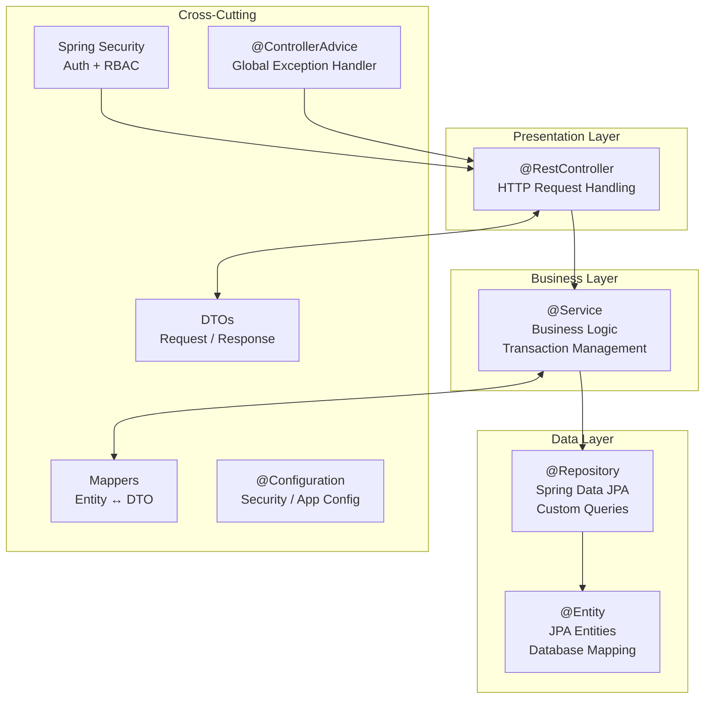

# MBU RouteX — Backend Architecture

> **Status:** PLANNED  
> **Version:** 1.0

---

## Framework

| Component | Technology |
|---|---|
| Framework | Spring Boot |
| Build tool | Maven |
| Language | Java 17+ |
| ORM | Spring Data JPA / Hibernate |
| Security | Spring Security |
| Database | MySQL |

---

## Layered Architecture



---

## Layer Responsibilities

### Controller Layer
- Annotated with `@RestController`
- Handles incoming HTTP requests
- Validates request format (basic)
- Delegates to Service layer
- Returns appropriate HTTP status codes and response bodies
- Does NOT contain business logic

### Service Layer
- Annotated with `@Service`
- Contains all business logic
- Manages `@Transactional` boundaries
- Uses DTOs for input/output
- Calls Repository layer for data
- Throws custom exceptions on business rule violations

### Repository Layer
- Annotated with `@Repository` or extends `JpaRepository`
- Provides CRUD operations via Spring Data JPA
- Custom query methods using `@Query` (JPQL or native)
- Does NOT contain business logic

### Entity Layer
- Annotated with `@Entity`
- Maps Java classes to database tables
- Defines relationships: `@OneToMany`, `@ManyToOne`, `@OneToOne`
- Uses `@Column` annotations for field mapping

### DTO Layer
- Plain Java objects (or records) for request/response
- Input DTOs: validate user input (`@Valid`, `@NotBlank`, etc.)
- Output DTOs: shape data for client consumption
- Never expose entities directly to the client

### Mapper Layer
- Converts Entity ↔ DTO
- Manual mapping or MapStruct (to be decided)
- Keeps entity model clean of presentation concerns

### Security Layer
- Spring Security configuration class
- HTTP security rules: which paths need which roles
- BCrypt password encoder bean
- Authentication provider setup

### Exception Layer
- `@ControllerAdvice` global handler
- Catches custom exceptions and returns structured JSON error responses
- Standard error response format

### Configuration Layer
- Spring Boot application properties
- Database connection configuration
- Security configuration
- CORS configuration (if needed)

---

## Standard Error Response Format

```json
{
  "timestamp": "2026-09-24T12:00:00",
  "status": 400,
  "error": "Bad Request",
  "message": "Validation failed for field: description",
  "path": "/api/student/complaints"
}
```

---

## Maven Dependencies (Core)

```xml
<!-- Spring Boot Starter Web -->
<dependency>
    <groupId>org.springframework.boot</groupId>
    <artifactId>spring-boot-starter-web</artifactId>
</dependency>

<!-- Spring Security -->
<dependency>
    <groupId>org.springframework.boot</groupId>
    <artifactId>spring-boot-starter-security</artifactId>
</dependency>

<!-- Spring Data JPA -->
<dependency>
    <groupId>org.springframework.boot</groupId>
    <artifactId>spring-boot-starter-data-jpa</artifactId>
</dependency>

<!-- MySQL Driver -->
<dependency>
    <groupId>com.mysql</groupId>
    <artifactId>mysql-connector-j</artifactId>
    <scope>runtime</scope>
</dependency>

<!-- Validation -->
<dependency>
    <groupId>org.springframework.boot</groupId>
    <artifactId>spring-boot-starter-validation</artifactId>
</dependency>

<!-- Thymeleaf (if server-side rendering) -->
<dependency>
    <groupId>org.springframework.boot</groupId>
    <artifactId>spring-boot-starter-thymeleaf</artifactId>
</dependency>

<!-- Lombok (optional) -->
<dependency>
    <groupId>org.projectlombok</groupId>
    <artifactId>lombok</artifactId>
    <optional>true</optional>
</dependency>
```

---

*MBU RouteX — TRACK · TRAVEL · CONNECT*
