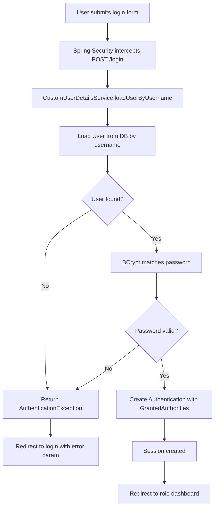

# MBU RouteX — Security Documentation

> **Status:** PLANNED  
> **Version:** 1.0

---

## Security Stack

| Component | Technology |
|---|---|
| Security framework | Spring Security |
| Password hashing | BCrypt |
| Session management | Server-side HTTP session (initial implementation) |
| Token strategy | Session-based (JWT consideration: FUTURE) |
| Transport | HTTPS (required in production) |

---

## Authentication

### Login Flow



### CustomUserDetailsService

```java
@Service
public class CustomUserDetailsService implements UserDetailsService {

    @Override
    public UserDetails loadUserByUsername(String username) throws UsernameNotFoundException {
        User user = userRepository.findByUsername(username)
            .orElseThrow(() -> new UsernameNotFoundException("User not found"));

        return org.springframework.security.core.userdetails.User
            .withUsername(user.getUsername())
            .password(user.getPasswordHash())
            .roles(user.getRole().name().replace("ROLE_", ""))
            .accountExpired(!user.isActive())
            .build();
    }
}
```

---

## Password Security

| Requirement | Implementation |
|---|---|
| Algorithm | BCrypt |
| Strength | Default strength 10 (adjustable) |
| Plain text | Never stored or logged |
| Transmission | Only over HTTPS in production |

```java
@Bean
public PasswordEncoder passwordEncoder() {
    return new BCryptPasswordEncoder();
}
```

---

## Authorization — Role-Based Access Control

### HTTP Security Configuration (Conceptual)

```java
@Configuration
@EnableWebSecurity
public class SecurityConfig {

    @Bean
    public SecurityFilterChain filterChain(HttpSecurity http) throws Exception {
        http
            .authorizeHttpRequests(auth -> auth
                // Public resources
                .requestMatchers("/", "/login/**", "/css/**", "/js/**", "/assets/**").permitAll()
                // Student endpoints
                .requestMatchers("/student/**", "/api/student/**").hasRole("STUDENT")
                // Driver endpoints
                .requestMatchers("/driver/**", "/api/driver/**").hasRole("DRIVER")
                // Management endpoints
                .requestMatchers("/management/**", "/api/management/**").hasRole("MANAGEMENT")
                // All other requests require authentication
                .anyRequest().authenticated()
            )
            .formLogin(form -> form
                .loginPage("/login")
                .defaultSuccessUrl("/dashboard", true)
                .failureUrl("/login?error=true")
                .permitAll()
            )
            .logout(logout -> logout
                .logoutUrl("/logout")
                .logoutSuccessUrl("/")
                .invalidateHttpSession(true)
                .clearAuthentication(true)
                .permitAll()
            )
            .exceptionHandling(ex -> ex
                .accessDeniedPage("/access-denied")
            )
            .sessionManagement(session -> session
                .maximumSessions(1)
                .expiredUrl("/login?expired=true")
            );

        return http.build();
    }
}
```

---

## Session Security

| Setting | Value |
|---|---|
| Session fixation | Mitigated (Spring default: new session on login) |
| Max concurrent sessions | 1 per user |
| Session timeout | Application server default (configurable) |
| Session expiry behavior | Redirect to login with `expired=true` param |
| Invalidation on logout | `invalidateHttpSession(true)` |

---

## Input Validation

All user input must be validated at two levels:

### Client-Side (Frontend)
- HTML5 input validation attributes
- JavaScript validation for user experience
- Not relied upon for security — server must also validate

### Server-Side (Backend)
- Bean Validation annotations on DTO classes
- `@Valid` on controller method parameters
- Custom validators where needed

```java
public class ComplaintRequestDto {

    @NotBlank(message = "Category is required")
    @Size(max = 100)
    private String category;

    @NotBlank(message = "Description is required")
    @Size(max = 2000, message = "Description must be under 2000 characters")
    private String description;
}
```

---

## SQL Injection Prevention

| Method | Implementation |
|---|---|
| Parameterized queries | Spring Data JPA uses parameterized queries by default |
| JPQL | Always use named parameters (`:param`), never string concatenation |
| Native SQL | Use `@Query` with named parameters only |
| Input sanitization | Validation annotations prevent unexpected inputs |

---

## XSS Prevention

| Method | Implementation |
|---|---|
| Output encoding | Thymeleaf auto-escapes output by default (`th:text`) |
| HTML rendering | Use `th:utext` only with explicitly safe content |
| Content-Security-Policy | Implement CSP headers in production |
| JSON responses | Spring MVC serializes JSON safely |

---

## CSRF Protection

| Approach | Notes |
|---|---|
| Spring Security CSRF | Enabled by default for form-based sessions |
| Thymeleaf integration | Thymeleaf CSRF token support built in |
| REST + JWT | CSRF typically disabled for stateless JWT APIs |
| Decision | Use CSRF protection for session-based form submissions |

---

## Sensitive Data Handling

| Data | Rule |
|---|---|
| Passwords | BCrypt stored; never returned in API responses |
| Phone numbers | Not returned unless explicitly required by the role |
| Session tokens | HttpOnly cookies; Secure flag in production |
| DB credentials | Environment variables; not in source code |
| JWT secret (future) | Environment variable; minimum 256-bit key |

---

## HTTP Response Security Headers

The following headers should be configured in production:

```
X-Content-Type-Options: nosniff
X-Frame-Options: DENY
X-XSS-Protection: 1; mode=block
Referrer-Policy: strict-origin-when-cross-origin
Content-Security-Policy: default-src 'self'; ...
Strict-Transport-Security: max-age=31536000; includeSubDomains
```

---

## Access Denied / Unauthorized Behavior

| Scenario | HTTP Code | Response |
|---|---|---|
| Unauthenticated request | 401 | Redirect to `/login` |
| Authenticated, wrong role | 403 | Redirect to `/access-denied` |
| Invalid credentials | Redirect | `/login?error=true` with error message |
| Session expired | Redirect | `/login?expired=true` |

---

## Security Testing Requirements

See `08-testing/SECURITY_TESTING.md` for full test cases.

Key security tests:
- Verify BCrypt hashing is applied
- Verify ROLE_STUDENT cannot access `/driver/**`
- Verify ROLE_DRIVER cannot access `/management/**`
- Verify ROLE_MANAGEMENT cannot access `/student/**`
- Verify unauthenticated requests are rejected
- Verify SQL injection attempts are blocked
- Verify XSS payloads are encoded in output
- Verify passwords never appear in responses or logs

---

*MBU RouteX — TRACK · TRAVEL · CONNECT*
