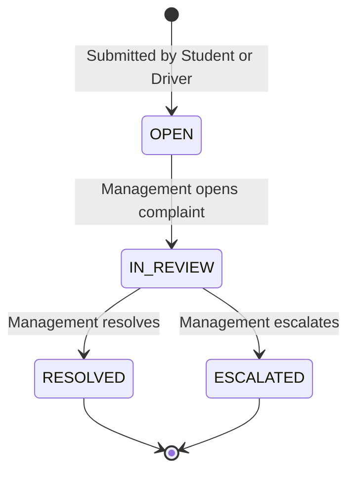

# MBU RouteX — Feature: Complaints

> **Roles:** ROLE_STUDENT (submit/view own) · ROLE_DRIVER (submit/view own) · ROLE_MANAGEMENT (view all / manage)  
> **Status:** MVP

---

## Purpose

A structured complaint management system that allows students and drivers to raise transportation-related issues, and management to review, respond to, and resolve them.

---

## Student Complaint Categories

| Category Key | Display Label |
|---|---|
| DELAY | Delay |
| DRIVER_BEHAVIOUR | Driver Behaviour |
| BUS_CONDITION | Bus Condition |
| OVERCROWDING | Overcrowding |
| ROUTE_ISSUE | Route Issue |
| CLEANLINESS | Cleanliness |
| OTHER | Other |

---

## Driver Complaint Categories

| Category Key | Display Label |
|---|---|
| TYRE_PROBLEM | Tyre Problem |
| BRAKE_PROBLEM | Brake Problem |
| ENGINE_PROBLEM | Engine Problem |
| MECHANICAL_ISSUE | Mechanical Issue |
| CLEANLINESS | Cleanliness |
| BUS_DAMAGE | Bus Damage |
| OTHER | Other |

---

## Complaint Status Lifecycle



---

## Complaint Fields

| Field | Required | Description |
|---|---|---|
| `category` | YES | Complaint category from list above |
| `description` | YES | Detailed description (max 2000 chars) |
| `bus_id` | Optional | Bus this complaint relates to |
| `trip_id` | Optional | Trip this complaint relates to |

---

## Management Complaint Actions

| Action | Description |
|---|---|
| View | Read full complaint details |
| Filter | By category, status, date, submitter type |
| Update Status | Move complaint through lifecycle |
| Add Response | Add management response visible to submitter |
| Resolve | Mark as RESOLVED |
| Escalate | Mark as ESCALATED for senior review |

---

## API Endpoints

```
Student:
GET  /api/student/complaints          — view own complaints
GET  /api/student/complaints/{id}     — view specific complaint
POST /api/student/complaints          — submit new complaint

Driver:
GET  /api/driver/complaints           — view own complaints
POST /api/driver/complaints           — submit new bus issue

Management:
GET  /api/management/complaints       — view all complaints
GET  /api/management/complaints/{id}  — view specific
PUT  /api/management/complaints/{id}/status    — update status
PUT  /api/management/complaints/{id}/response  — add response
```

---

## Related Entities

- `Complaint` — main complaint record
- `ComplaintStatus` — status change history
- `User` — submitter reference
- `Bus` — optional bus reference
- `Trip` — optional trip reference

---

*MBU RouteX — TRACK · TRAVEL · CONNECT*
