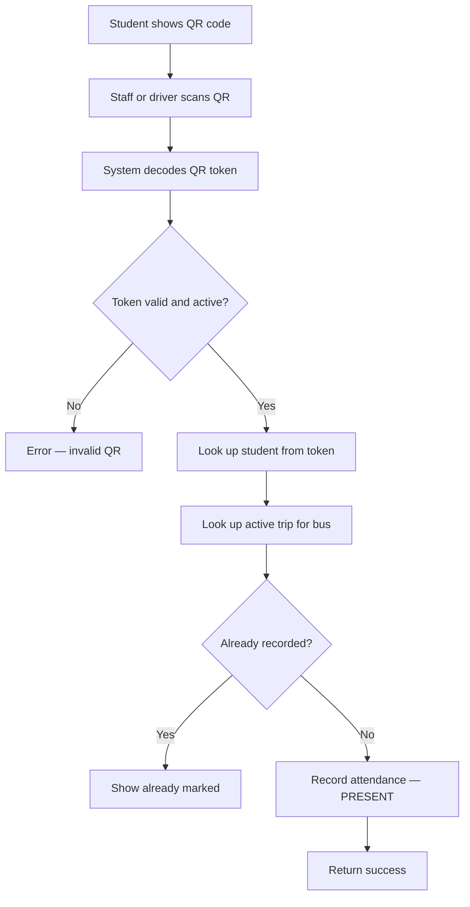

# MBU RouteX — Feature: QR Attendance

> **Module:** Student Dashboard — Box 5: Attendance – My QR  
> **Role:** ROLE_STUDENT  
> **Status:** PLANNED

---

## Purpose

Provide each student with a unique, scannable QR code for digital bus attendance tracking. Replace paper-based roll calls with a reliable digital system.

---

## Student View

| Element | Description |
|---|---|
| QR Code Display | Large, clearly visible QR code for scanning |
| Student Name | Displayed below or beside QR |
| Student ID | For visual verification |
| Check-in Status | Current trip scan status (if applicable) |
| Attendance History | Table of past attendance records |

---

## QR Code Generation

| Property | Specification |
|---|---|
| Token | Cryptographically secure unique string (UUID or similar) |
| Uniqueness | One QR code per student |
| Persistence | Stored in `qr_codes` table |
| Expiry | Optional — to be defined by project owner |
| Re-generation | System may re-generate if token is compromised |

---

## Attendance Recording Flow



---

## Attendance Record Fields

| Field | Description |
|---|---|
| `student_id` | Which student |
| `trip_id` | Which trip |
| `qr_code_id` | Which QR was used |
| `scanned_at` | Timestamp of scan |
| `status` | PRESENT / ABSENT / LATE |

---

## Attendance History Display

The student can view their attendance history:

| Date | Trip / Route | Status |
|---|---|---|
| DEMO DATA | DEMO DATA | DEMO DATA |

> All sample rows are DEMO DATA — real data comes from the database.

---

## API Endpoints

```
GET /api/student/attendance/qr       — Get student's QR code data
GET /api/student/attendance          — Get attendance history
GET /api/student/attendance/status   — Get current check-in status
```

---

## QR Code Library

The QR code can be generated using a Java library such as:
- **ZXing (Zebra Crossing)** — open source, widely used

The QR image may be generated server-side and served as an image, or the token can be sent to the client for client-side rendering.

---

## Related Entities

- `QRCode` — student QR token storage
- `Attendance` — scan records
- `Trip` — trip reference for attendance
- `Student` — student reference

---

*MBU RouteX — TRACK · TRAVEL · CONNECT*
