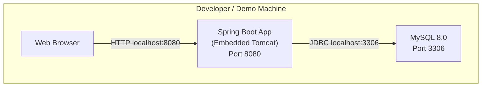
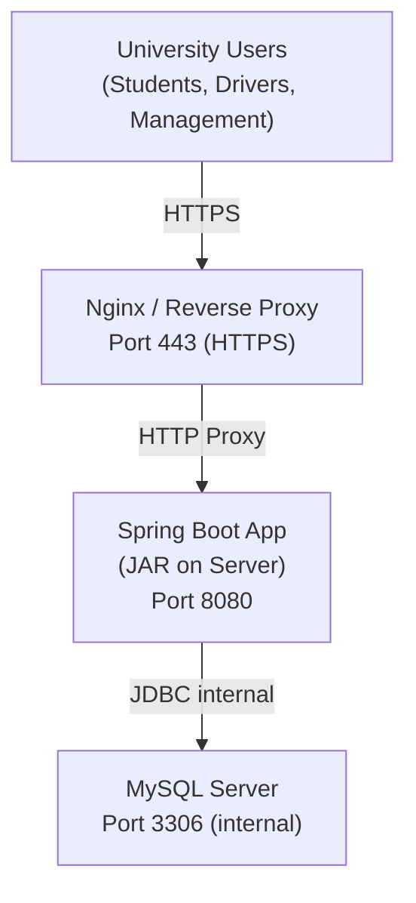

# MBU RouteX — Deployment Architecture

> **Status:** PLANNED  
> **Version:** 1.0

---

## Deployment Target

| Environment | Target |
|---|---|
| Development | Local machine (developer's laptop) |
| Demonstration | Local or shared university server |
| Production (future) | University server or cloud (TO BE CONFIRMED) |

---

## Development Deployment

```
Developer Machine
 └── Java 17 JRE
 └── Spring Boot (embedded Tomcat, port 8080)
 └── MySQL 8.0 (localhost:3306)
 └── Browser: http://localhost:8080
```

---

## Component Diagram



---

## Production Deployment (Planned)



---

## Build and Run (JAR)

```bash
# Build production JAR
mvn clean package -DskipTests

# Run JAR
java -jar target/mbu-routex-1.0.0.jar --spring.profiles.active=prod
```

---

## Environment Configuration

| Environment | Profile | Configuration File |
|---|---|---|
| Development | `dev` | `application-dev.properties` |
| Production | `prod` | `application-prod.properties` (not in Git) |

### application-prod.properties (template — keep out of Git)

```properties
spring.datasource.url=jdbc:mysql://<PROD_DB_HOST>:3306/mbu_routex
spring.datasource.username=${DB_USERNAME}
spring.datasource.password=${DB_PASSWORD}
spring.jpa.hibernate.ddl-auto=validate
server.port=8080
logging.level.com.mbu.routex=WARN
```

---

## Production Security Checklist

| Requirement | Status |
|---|---|
| HTTPS enforced via reverse proxy | PLANNED |
| DB credentials in environment variables (not source) | PLANNED |
| `ddl-auto=validate` (not `create-drop`) | PLANNED |
| Debug logging disabled | PLANNED |
| Stack traces not exposed to client | PLANNED |
| BCrypt password hashing active | PLANNED |

---

*MBU RouteX — TRACK · TRAVEL · CONNECT*
